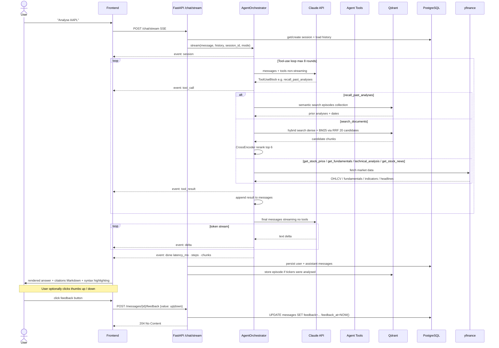
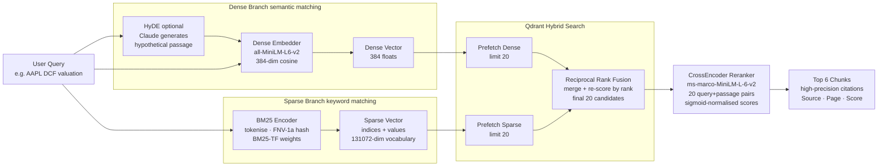
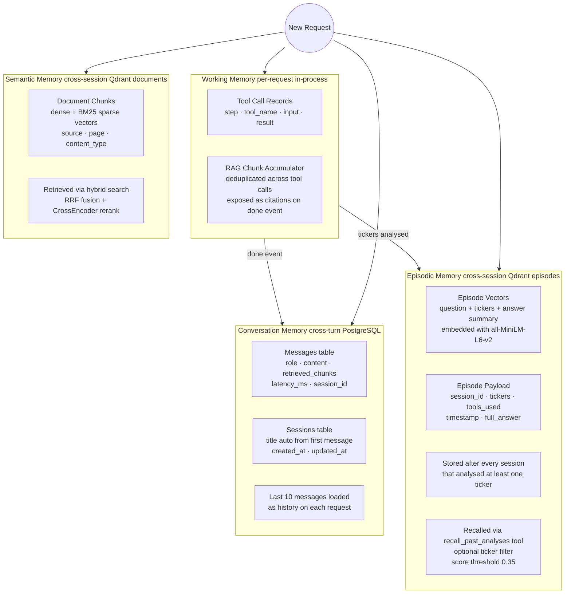
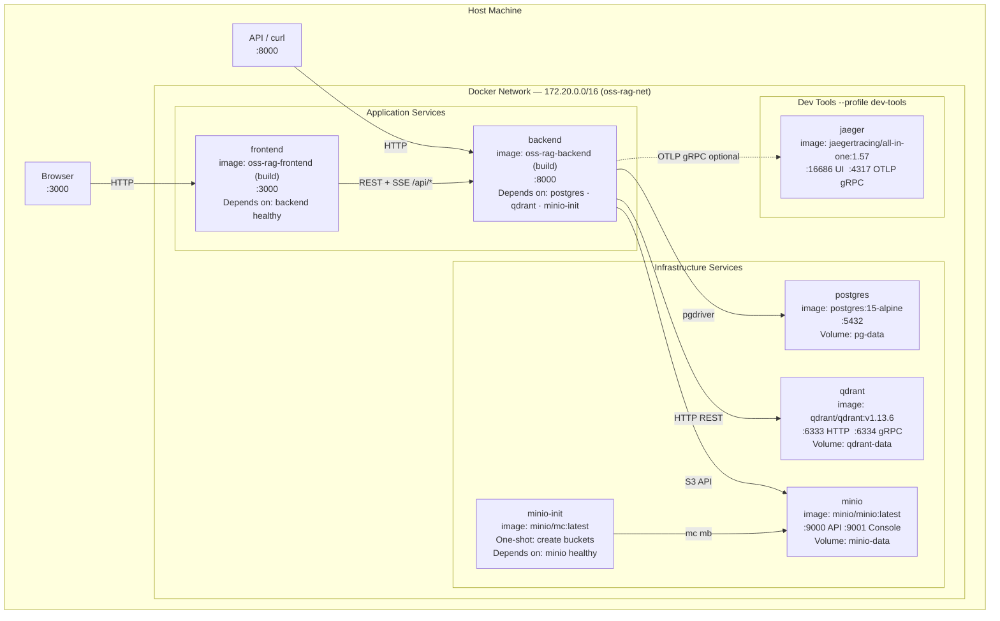
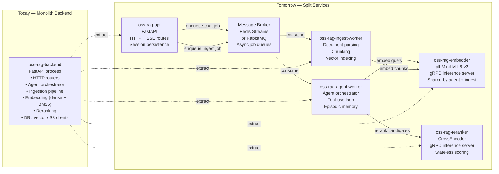
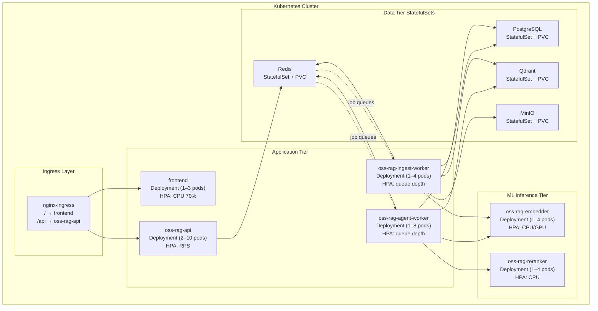

# OSS RAG Stack — Solution Architecture v1

> Stack: FastAPI · React/TypeScript · Claude (Anthropic) · Qdrant · PostgreSQL · MinIO · Docker Compose
> Domain: Virtual Investment Firm — Multi-Agent Platform with 6 Investment Focus Areas
> Current version: v1.4.1 — Phase B complete: 20 tools, portfolio tracker, retirement calculator, crypto data, Focus Area dropdown, conflict-free port assignments

---

## 1. System Overview

```mermaid
graph TB
    subgraph Frontend["Frontend — React / TypeScript / Tailwind (port 3010)"]
        Auth["AuthPage\n• Login / Register\n• JWT token storage"]
        Chat["Chat View\n• Streaming SSE\n• Focus Area dropdown (header)\n• Tool activity indicator\n• Smart auto-scroll · Error retry"]
        Settings["Settings Page\n• Investor Profile form\n• Age · Risk · Goals · Horizon\n• Portfolio size · Tax accounts"]
        Portfolio["Portfolio View\n• Add / Edit / Delete positions\n• Ticker · Shares · Avg cost\n• Ask Casey for live P&L"]
        Docs["Document Manager\n• Upload / Re-index\n• Status tracking"]
        Sess["Session Sidebar\n• History / Switch sessions\n• Collapsible (icon-only mode)\n• Portfolio + Investor Profile nav"]
        Cite["Citations Panel\n• Source · Page · Score"]
        MB["MessageBubble\n• Focus area label badge\n• MarkdownContent renderer\n• Syntax-highlighted code\n• Feedback thumbs up/down"]
    end

    subgraph Backend["Backend — FastAPI / Python 3.12 (port 8010)"]
        OTel["OpenTelemetry\nFastAPIInstrumentor\nagent.run span\ntool.name spans"]

        subgraph Routers["API Routers"]
            AuthR["/auth\nRegister · Login · Me"]
            ChatR["/chat/stream  SSE\n/chat  JSON\nagent_id · investor_profile"]
            DocR["/documents\nUpload · List · Delete · Reindex"]
            SessR["/sessions\nCRUD · Message history"]
            MsgR["/messages/{id}/feedback\nThumb up/down  204"]
            ProfR["/profile\nGET + PUT  investor profile"]
            PortR["/portfolio\nGET positions · POST add · PUT update · DELETE"]
        end

        subgraph AgentLayer["Agent Layer — Phase A + B"]
            Orch["AgentOrchestrator\naccepts agent_id + investor_profile + user_id\nFIRM_MODE guardrail\nTool-use loop  max 8 steps\nYields SSE events per step"]
            Personas["6 Focus Areas (internal personas)\nEquity Research   equity_analyst    11 tools\nTechnical Analysis technical_trader   6 tools\nMacro & Economics  macro_strategist  7 tools\nRetirement Planning retirement_planner 10 tools\nCrypto & Digital   crypto_analyst    6 tools\nPortfolio Strategy portfolio_strategist 10 tools\nAll Areas          auto              20 tools"]
            WMem["Working Memory\nPer-request tool call trace\nRAG chunk accumulator"]
            EMem["Episodic Memory Store\nVectorised past analyses\nStored after each session"]
        end

        subgraph ToolSet["20 Agent Tools"]
            T1["recall_past_analyses\nsearch_documents\nget_stock_price\nget_fundamentals\ntechnical_analysis\nget_stock_news"]
            T2["get_options_chain\nget_earnings_history\nget_insider_transactions\nget_institutional_holdings\nget_sector_performance"]
            T3["screen_stocks\nget_market_breadth\nget_analyst_upgrades\ncalculate_dcf\ncompare_stocks\nget_economic_indicators"]
            T4["get_crypto_data\nget_portfolio_summary\ncalculate_retirement"]
        end

        subgraph Retrieval["Retrieval Pipeline"]
            BM25["BM25 Sparse Encoder\nFNV-1a hash · BM25-TF"]
            Dense["Dense Embedder\nall-MiniLM-L6-v2  384-dim"]
            Hyde["HyDE  optional"]
            Hybrid["Qdrant Hybrid Search\nRRF fusion  20 candidates"]
            Rerank["CrossEncoder Reranker\nTop 6 of 20 candidates"]
        end

        Ingest["Ingestion Pipeline\nPDF · DOCX · PPTX · HTML · Images\nBM25 + Dense embed at index time"]
    end

    subgraph Storage["Storage Layer"]
        PG[("PostgreSQL\nusers · investor_profiles\nSessions · Messages · feedback\nDocument metadata · Chunks")]
        QD[("Qdrant\ndocuments collection\n384-dim dense + BM25 sparse\n\nepisodes collection\nPast analysis vectors")]
        MIO[("MinIO  S3-compatible\nRaw document files")]
    end

    subgraph External["External APIs"]
        Claude["Anthropic Claude\nclaude-sonnet-4-6\nTool-use · Streaming\nVision · HyDE generation"]
        YF["yfinance\n17 market data tools\nno API key required"]
    end

    Auth --> AuthR
    Chat & Docs & Sess & MB & Settings --> ChatR & DocR & SessR & MsgR & ProfR
    ChatR --> Orch
    ChatR --> OTel
    Orch --> OTel
    Orch --> Personas
    DocR --> Ingest
    SessR & ProfR --> PG
    MsgR -->|"feedback"| PG
    Orch --> WMem & EMem
    Orch -->|"tool rounds"| Claude
    Orch -->|"final streaming answer"| Claude
    Orch --> T1 & T2 & T3
    T1 --> BM25 & Dense & Hyde & QD & YF
    T2 & T3 --> YF
    Hyde --> Dense
    BM25 & Dense --> Hybrid
    Hybrid --> Rerank
    EMem --> QD
    Ingest -->|"raw files"| MIO
    Ingest -->|"BM25 + dense vectors"| QD
    Ingest -->|"chunk records"| PG
    Ingest -->|"image captions"| Claude
    ChatR -->|"persist exchange + episodic store"| PG & QD
```



---

## 2. Request Lifecycle — Sequence Diagram



---

## 3. Retrieval Pipeline — Phase 1 Detail



---

## 4. Memory Architecture



---

## 5. Component Inventory

| Component | Technology | Purpose |
|---|---|---|
| Frontend | React 18 · TypeScript · Tailwind · Vite | Chat UI, document manager, session history |
| Markdown renderer | react-markdown · remark-gfm · Tailwind Typography | Rich formatted assistant responses |
| Syntax highlighter | react-syntax-highlighter · Prism (lazy-loaded) | Code blocks with One Dark theme |
| Help modal | Custom React · Tailwind | 4-step onboarding flow, localStorage persistence |
| Backend API | FastAPI · Uvicorn · SSE-Starlette | HTTP + streaming SSE endpoints |
| Observability | OpenTelemetry SDK · OTLP gRPC exporter | Distributed traces: HTTP routes + agent spans |
| Agent Orchestrator | Custom · Anthropic SDK tool_use | Multi-step planning and tool execution |
| Dense Embedder | sentence-transformers/all-MiniLM-L6-v2 | 384-dim semantic vectors |
| Sparse Embedder | Custom BM25 (no deps) | Keyword / ticker matching |
| Re-ranker | CrossEncoder ms-marco-MiniLM-L-6-v2 | Precision pass over hybrid candidates |
| Vector Store | Qdrant v1.13.6 | Dense + sparse vectors, hybrid RRF search |
| Relational DB | PostgreSQL 15 | Sessions, messages (+ feedback), document metadata |
| Object Storage | MinIO (S3-compatible) | Raw uploaded document files |
| LLM | Claude claude-sonnet-4-6 | Reasoning, tool-use, streaming, vision |
| Market Data | yfinance | Price, fundamentals, technicals, news |
| Ingestion | PyMuPDF · pymupdf4llm · Unstructured | PDF, DOCX, PPTX, HTML, image parsing |
| Chunking | LangChain RecursiveCharacterTextSplitter | 512-char chunks, 128-char overlap |
| Infra | Docker Compose | Fully containerised local deployment |

---

## 6. Feature Flags  `.env`

| Variable | Default | Effect |
|---|---|---|
| `USE_HYBRID_SEARCH` | `true` | Enable BM25 sparse + dense RRF fusion |
| `USE_RERANKING` | `true` | CrossEncoder second-pass over 20 candidates |
| `RERANK_CANDIDATES` | `20` | How many candidates to fetch before re-ranking |
| `USE_HYDE` | `false` | Generate hypothetical answer before dense embed |
| `AGENT_DOMAIN` | `stock_analysis` | System prompt domain: `stock_analysis` or `general` |
| `AGENT_MAX_STEPS` | `8` | Max tool-call rounds per request |
| `CHAT_MODE` | `expert_context` | Default mode: `expert_context` or `strict_rag` |
| `EMBEDDING_MODEL` | `all-MiniLM-L6-v2` | Sentence-transformers model for dense vectors |
| `RETRIEVAL_TOP_K` | `8` | Final chunks returned after re-ranking |
| `OTEL_EXPORTER_OTLP_ENDPOINT` | _(unset)_ | gRPC endpoint for traces; no-op when unset |

---

## 7. Container Architecture

### 7.1 Service Topology



### 7.2 Health-Check Dependency Chain

Services only start after their upstream dependencies pass health checks, preventing connection-refused errors at boot:

```text
postgres   ──healthy──►  backend  ──healthy──►  frontend
qdrant     ──healthy──►  backend
minio      ──healthy──►  minio-init ──complete──►  backend
```

| Service | Health Check | Interval / Retries |
|---|---|---|
| `postgres` | `pg_isready -U $POSTGRES_USER` | 5 s / 5 |
| `qdrant` | `curl -f http://localhost:6333/healthz` | 5 s / 10 |
| `minio` | `curl -f http://localhost:9000/minio/health/live` | 5 s / 10 |
| `backend` | `curl -f http://localhost:8010/health` | 10 s / 5 |
| `minio-init` | _(one-shot; exits 0 on success)_ | — |

### 7.3 Named Volumes — Data Persistence

| Volume | Mounted In | Contents |
|---|---|---|
| `pg-data` | `postgres:/var/lib/postgresql/data` | Sessions, messages, feedback, document metadata |
| `qdrant-data` | `qdrant:/qdrant/storage` | Dense + sparse vectors (documents + episodes collections) |
| `minio-data` | `minio:/data` | Raw uploaded files (PDF, DOCX, PPTX, HTML, images) |
| `backend-models` | `backend:/app/models` | Downloaded sentence-transformer + cross-encoder model weights |

All volumes survive `docker compose down` and are only removed with `docker compose down -v`.

### 7.4 Compose Profiles

| Profile | Command | Extra Services Started |
|---|---|---|
| _(default)_ | `docker compose up -d` | `postgres`, `qdrant`, `minio`, `minio-init`, `backend`, `frontend` |
| `dev-tools` | `docker compose --profile dev-tools up -d` | Above + `jaeger` (OTel trace UI at `:16686`) |
| `production` | `docker compose --profile production up -d` | Default stack with resource limits applied |

### 7.5 Port Map

| Service | Host Port | Purpose |
|---|---|---|
| `frontend` | `3000` | React UI |
| `backend` | `8000` | FastAPI REST + SSE |
| `postgres` | `5432` | Direct DB access (dev only) |
| `qdrant` | `6333` | Qdrant HTTP API |
| `qdrant` | `6334` | Qdrant gRPC API |
| `minio` | `9000` | S3-compatible object API |
| `minio` | `9001` | MinIO web console |
| `jaeger` | `16686` | Jaeger trace UI _(dev-tools profile)_ |
| `jaeger` | `4317` | OTLP gRPC ingest _(dev-tools profile)_ |

---

## 8. Microservices Evolution

The current deployment runs as a monolithic backend container. The architecture is deliberately structured so each logical subsystem can be extracted into an independent service without changing external interfaces.

### 8.1 Current State vs. Target State



### 8.2 Decomposition Steps

| Phase | Action | Benefit |
|---|---|---|
| 1 | Extract `oss-rag-embedder` — move sentence-transformers model load to a dedicated gRPC service | Scale embedding independently; share one model across agent and ingest |
| 2 | Extract `oss-rag-reranker` — CrossEncoder behind gRPC | Scale re-ranking independently; zero model reload on agent restarts |
| 3 | Extract `oss-rag-ingest-worker` — consume from broker queue | Non-blocking uploads; parallel ingestion workers |
| 4 | Extract `oss-rag-agent-worker` — consume chat jobs from broker | Horizontal scale for concurrent chat sessions; independent agent deploys |
| 5 | Slim `oss-rag-api` to routing + session I/O only | Tiny stateless pod; no ML dependencies |
| 6 | Kubernetes deployment — each service gets `Deployment` + `HPA` | Auto-scale on CPU/GPU/queue depth; rolling updates with zero downtime |

### 8.3 Kubernetes Target Layout



### 8.4 Interface Contracts (No Breaking Changes)

The external API surface (`/chat/stream`, `/documents`, `/sessions`, `/messages/{id}/feedback`) stays identical throughout the decomposition. Internal service communication migrates from in-process function calls to:

- **gRPC** — embedder and reranker (low-latency, strongly typed protobuf schemas)
- **Message broker** — ingest jobs and chat jobs (decoupled, retryable, backpressure-aware)
- **Shared PostgreSQL** — sessions and messages remain the single source of truth

This means the React frontend never needs to change as the backend evolves from monolith to microservices.
