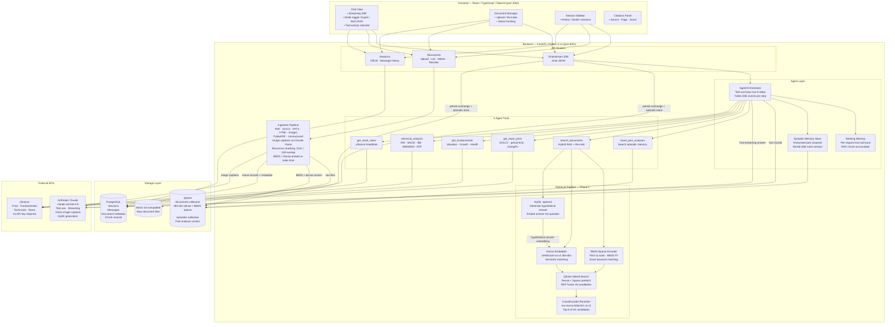
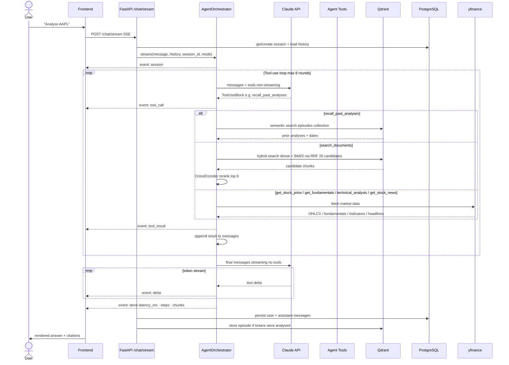
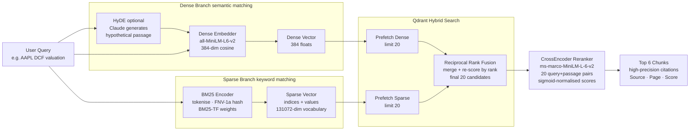
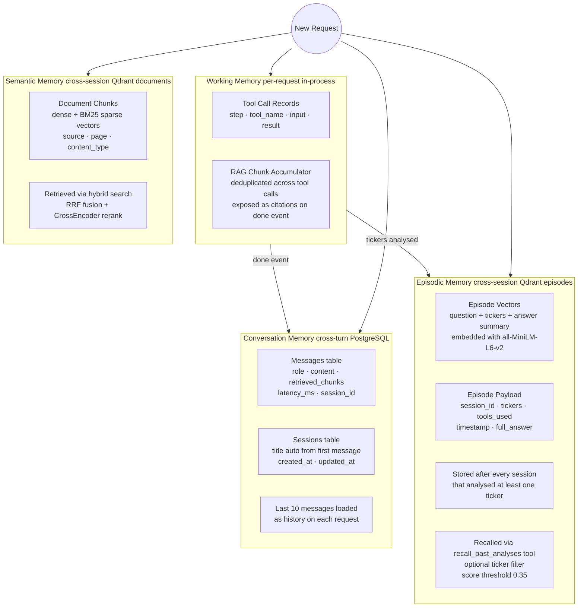

# OSS RAG Stack — Solution Architecture v1

> Stack: FastAPI · React/TypeScript · Claude (Anthropic) · Qdrant · PostgreSQL · MinIO · Docker Compose
> Domain: Multi-step Agentic Stock Analysis with Hybrid RAG and Episodic Memory

---

## 1. System Overview

---

## 2. Request Lifecycle — Sequence Diagram

---

## 3. Retrieval Pipeline — Phase 1 Detail

---

## 4. Memory Architecture

---

## 5. Component Inventory

| Component | Technology | Purpose |
|---|---|---|
| Frontend | React 18 · TypeScript · Tailwind · Vite | Chat UI, document manager, session history |
| Backend API | FastAPI · Uvicorn · SSE-Starlette | HTTP + streaming SSE endpoints |
| Agent Orchestrator | Custom · Anthropic SDK tool_use | Multi-step planning and tool execution |
| Dense Embedder | sentence-transformers/all-MiniLM-L6-v2 | 384-dim semantic vectors |
| Sparse Embedder | Custom BM25 (no deps) | Keyword / ticker matching |
| Re-ranker | CrossEncoder ms-marco-MiniLM-L-6-v2 | Precision pass over hybrid candidates |
| Vector Store | Qdrant v1.13.6 | Dense + sparse vectors, hybrid RRF search |
| Relational DB | PostgreSQL 15 | Sessions, messages, document metadata |
| Object Storage | MinIO (S3-compatible) | Raw uploaded document files |
| LLM | Claude claude-sonnet-4-6 | Reasoning, tool-use, streaming, vision |
| Market Data | yfinance | Price, fundamentals, technicals, news |
| Ingestion | PyMuPDF · pymupdf4llm · Unstructured | PDF, DOCX, PPTX, HTML, image parsing |
| Chunking | LangChain RecursiveCharacterTextSplitter | 512-char chunks, 128-char overlap |
| Infra | Docker Compose | Fully containerised local deployment |

---

## 6. Feature Flags  `.env`

| Variable | Default | Effect |
|---|---|---|
| `USE_HYBRID_SEARCH` | `true` | Enable BM25 sparse + dense RRF fusion |
| `USE_RERANKING` | `true` | CrossEncoder second-pass over 20 candidates |
| `RERANK_CANDIDATES` | `20` | How many candidates to fetch before re-ranking |
| `USE_HYDE` | `false` | Generate hypothetical answer before dense embed |
| `AGENT_DOMAIN` | `stock_analysis` | System prompt domain: `stock_analysis` or `general` |
| `AGENT_MAX_STEPS` | `8` | Max tool-call rounds per request |
| `CHAT_MODE` | `expert_context` | Default mode: `expert_context` or `strict_rag` |
| `EMBEDDING_MODEL` | `all-MiniLM-L6-v2` | Sentence-transformers model for dense vectors |
| `RETRIEVAL_TOP_K` | `8` | Final chunks returned after re-ranking |
